# How to Get Started
Please read COPYING and EULA before proceeding
## Getting started from a binary
Download the appropriate zip/installer file for the OS you would like to run the program on. 
## Getting started from source
Clone this repo
```
git clone https://github.com/epicblockchain/epic-dashboard.git
npm install
npm start
```
After bundling a window should open with the app running.
## Building from source
To build all executables run
```
npm run make
```
To build only a specific executable open the makefile and run electron-forge make, editing --platform and --arch to your platform and architecture. You may need to install the electron-forge CLI: https://www.electronforge.io/cli

# Usage

1. Download the dashboard software from [here](https://github.com/epicblockchain/epic-dashboard/releases/)
2. Use the sidebar on the left to navigate to tabs.

## Instructions for VPN users

Note that the software uses MDNS to discover miners on your network. This functionality does not work over a VPN. You will need to navigate to the Miner List tab and manually add miners.

## Miner Settings

To modify the settings for the miner use the sidebar to navigate to the Table tab. If the sidebar is not open it can be opened using the button in the top left of the screen.

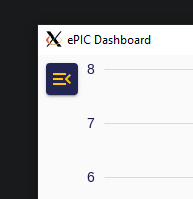
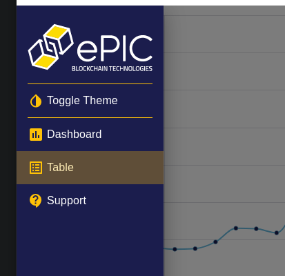

You must select which miners to apply the settings to by clicking the checkboxes on the left side of each row in the table.

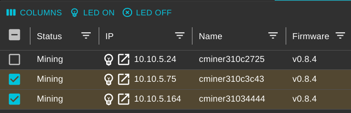

By default all of the miners have a password of **letmein**.

After clicking apply you will recieve feedback letting you know if the request succeeded or failed.

### Updating Coin

Click on the "COIN" tab. Fill out the fields and click apply.

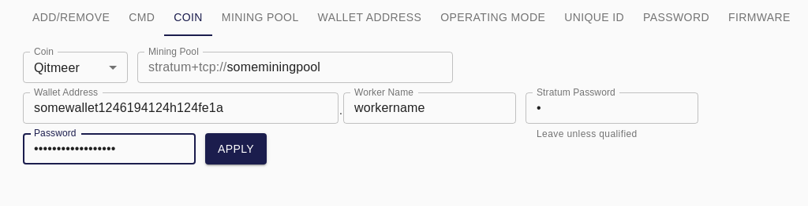

### Updating mining pool

Click on the "MINING POOL" tab. Fill out the fields and click apply.

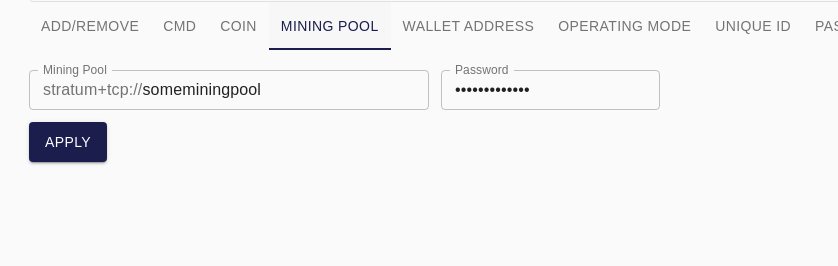

### Updating wallet address

Click on the "WALLET ADDRESS" tab. Fill out the fields and click apply.

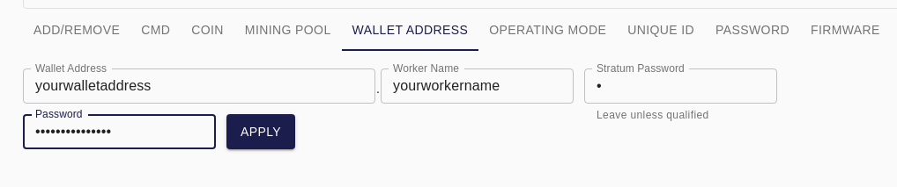

### Updating operating mode

Click on the "OPERATING MODE" tab. Fill out the fields and click apply. Your miner may take up to 15 minutes to recalibrate with the new operating mode.

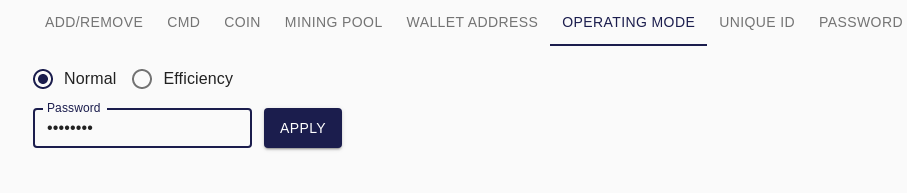

### Updating appending unique id to miner name

Click on the "UNIQUE ID" tab. Fill out the fields and click apply. This adds or removes the unique string at the end of the miner name.

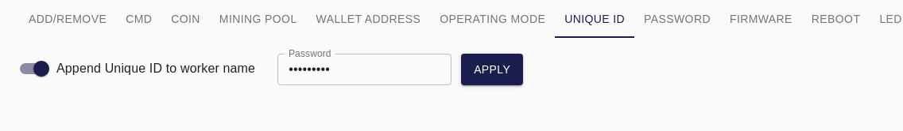

### Updating password

Click on the "PASSWORD" tab. Fill out the fields and click apply.

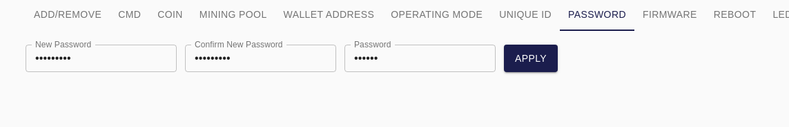

### Updating firmware

Use your preferred internet browser to go to https://github.com/epicblockchain/epic-miner/releases and download the latest release of the firmware. Extract the zip file and note its location. Click on the "FIRMWARE" tab. Click browse and select the location of the extracted zip folder. Select the file ending in .swu within that folder. The "Maintain config over update" will save your settings across the update. Fill out the rest of the fields and click apply. You miner will take up to 15 minutes to reboot and recalibrate.


### Rebooting your miner

Click on the "REBOOT" tab. Fill out the fields and click apply. Your miner may take a few minutes to reboot.
A softreboot will only restart the mining program.

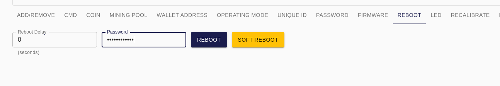

### Recalibrating your miner

Click on the "RECALIBRATE" tab. Fill out the fields and click apply. Your miner may take up to 15 minutes to reboot and recalibrate.

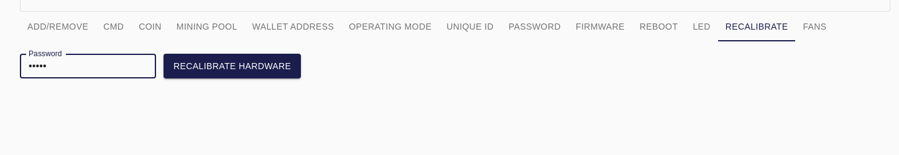

### Control fans on

Click on the "FANS" tab. Fill out the fields and click apply.


### Control LED on miner

Click on the "LED" tab. Fill out the fields and click apply.

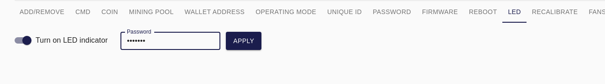

### Miner command tab

Click on the "CMD" tab. Fill out the fields and click apply.

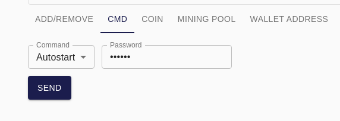

## Adding/Removing/Blacklisting Miners
Use the interface in the Table page to add, save, blacklist and load miners. These will be stored in a line seperated text file:
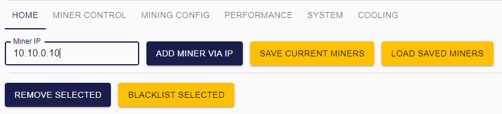
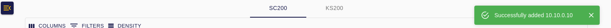
#### Linux: 
* ~/.ePIC-Dashboard/ipaddr.txt for saving miners
* ~/.ePIC-Dashboard/blacklist.txt for blacklisting miners by their hostname and mdns broadcast: (e.g. "epicminer340035._epicminer._tcp.local")
#### Windows:
* %APPDATA%/ePIC-Dashboard/ipaddr.txt
* %APPDATA%/ePIC-Dashboard/blacklist.txt
#### Mac:
* ~/Library/Application Support/ePIC-Dashboard/ipaddr.txt
* ~/Library/Application Support/ePIC-Dashboard/blacklist.txt