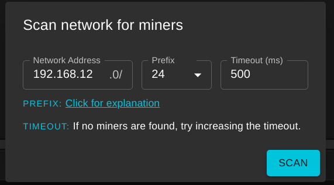
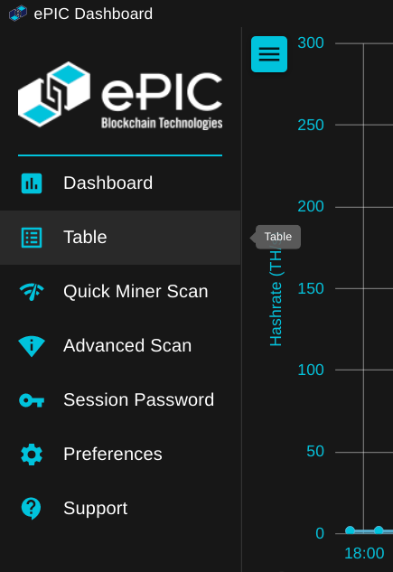
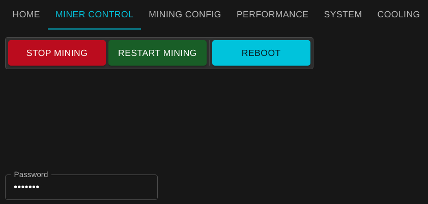
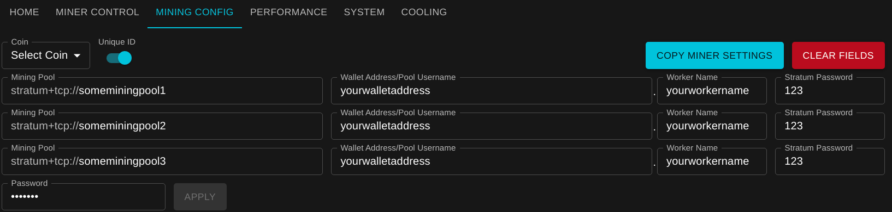
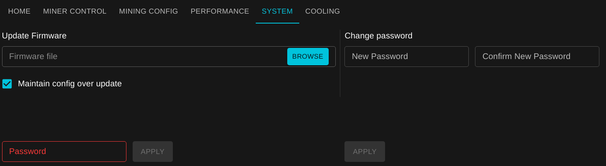
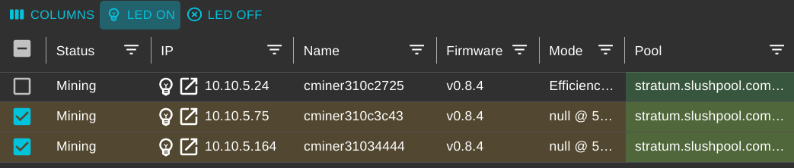

# How to Get Started

Please read COPYING and EULA before proceeding

## Getting started from a binary

Download the appropriate zip/installer file for the OS you would like to run the program on.

## Getting started from source

Clone this repo

```
git clone https://github.com/epicblockchain/epic-dashboard.git
npm install
npm start
```

After bundling a window should open with the app running.

## Building from source on a fresh machine

### Dependencies

Some dependencies are required to build the dashboard, this process has been tested on Ubuntu 20.04 with a 64 bit cpu

```
sudo apt update
sudo apt install -y curl make git wine mono-devel fakeroot zip rpm
# if you need to build for 32 bit architectures
sudo dpkg --add-architecture i386
sudo apt update
sudo apt install -y wine32
# end of building for 32 bit
# or install the latest
curl -o- https://raw.githubusercontent.com/nvm-sh/nvm/v0.38.0/install.sh | bash nvm on your own
export NVM_DIR="$([ -z "${XDG_CONFIG_HOME-}" ] && printf %s "${HOME}/.nvm" || printf %s "${XDG_CONFIG_HOME}/nvm")"
[ -s "$NVM_DIR/nvm.sh" ] && \. "$NVM_DIR/nvm.sh" # This loads nvm
# end of nvm stuff
nvm install 16
cd /path/to/epic-dashboard
npm i
```

### Building

To build all executables run

```
make dist
# see the makefile if you want to install for only one target+architecture
```

To build only a specific executable open the makefile and run the appropriate command ensureing --platform and --arch match your desired platform and architecture to build for.

# Usage

1. Download the dashboard software from [here](https://github.com/epicblockchain/epic-dashboard/releases/)
2. Use the sidebar on the left to navigate to tabs.

## System Password

By default all of the miners have a password of **letmein**.

## Scanning for miners

To discover miners on your network, you can first try using the "Quick Miner Scan" in the sidebar. This will scan the network the computer is currently connected to for miners.


If none are found or you want to scan additional networks, click on "Advanced Scan" in the sidebar. Enter in the address of the network to scan, and then choose the prefix. An explanation can be found [here](https://docs.netgate.com/pfsense/en/latest/network/cidr.html).

In short, if you ip is 192.168.12.1, /24 will scan 192.168.12.0-255 (256 ips), and /16 will scan 192.168.0-255.0-255 (65,536 ips). If /16 is chosen, the scan may take up to 1 minute depending on the speed of your network and computer.



## Miner Settings

To modify the settings for the miner use the sidebar to navigate to the Table tab. If the sidebar is not open it can be opened using the button in the top left of the screen.



You must select which miners to apply the settings to by clicking the checkboxes on the left side of each row in the table.


By default all of the miners have a password of **letmein**.

After clicking apply you will recieve feedback letting you know if the request succeeded or failed.

### Control your miner

Click on the "MINER CONTROL" tab. Fill out the password and then click the desired command. Your miner may take a few to reboot.



### Updating Mining Configuration

Click on the "MINING CONFIG" tab. The latest firmware supports 3 mining pools in case a connection cannot be made, which takes precedence from top to bottom. "Unique ID" will append the unique miner id at the end of the worker name if enabled.

To copy a miner's config into the fields, select the miner and then click the "Copy miner settings" button. All fields can also be cleared with the "clear fields" button.



### Updating Performance Preset

Click on the "PERFORMANCE" tab. Choose the desired preset, fill out the fields and click apply. Your miner may take up to 15 minutes to recalibrate with the new preset.


### Update System settings

These are under the "SYSTEM" tab.

#### Update miner firmware

Go to https://github.com/epicblockchain/epic-miner/releases and download the latest release of the firmware. Extract the zip file and note its location. Click browse and select the location of the extracted zip folder. Select the file ending in .swu within that folder. The "Maintain config over update" will save your settings across the update. Fill out the rest of the fields and click apply. You miner will take up to 15 minutes to reboot and recalibrate.

#### Update miner password

Enter your new password, confirm it, then the current miner password and click apply.



### Control fan speed

Click on the "COOLING" tab. Set the desired fan speed and apply.

**NOTE: There is a minimum fan speed tied to the miner's current preset. If a speed lower than that is sent, it will be ignored, with no feedback.**


### Finding/Identifying a miner

This is if you have multiple miners and need to identify which is which. If you need to identify one, click the lightbulb icon in the ip column. The icon should start blinking, indicating the miner's LED is on. **NOTE: This is not supported by older firmware. See the following section.**


If you need to identify multiple miners or miners with older firmware, you can select the miners and then click the "LED ON/OFF" buttons at the top of the table.



Alternatively, if you need to identify the IP of a specific miner, press the button next to the LED lights on the control board.


On the dashboard, the light bulb icon of the miner will then be blinking. Once you have identified the IP, you may click on the flashing light bulb icon to turn the LED off.


### Opening Web Dashboard

For a more visual display of a single miner, the web dashboard can be access by typing the IP address of the miner into your favourite browser or by pressing the "Open In Browser" button next to the LED button.


## Adding/Removing/Blacklisting Miners

Use the interface in the Table page to add, save, blacklist and load miners. Blacklisted miners will be ignored by quick scan/advanced scan.


These will be stored in a line seperated text file:

#### Linux:

-   ~/.ePIC-Dashboard/ipaddr.txt contains saved miners by ip
-   ~/.ePIC-Dashboard/blacklist.txt contains blacklisted miners by their hostname/unique id: (e.g. "epicminer30032518")

#### Windows:

-   %APPDATA%/ePIC-Dashboard/ipaddr.txt
-   %APPDATA%/ePIC-Dashboard/blacklist.txt

#### Mac:

-   ~/Library/Application Support/ePIC-Dashboard/ipaddr.txt
-   ~/Library/Application Support/ePIC-Dashboard/blacklist.txt

## API

[APIv3](docs/APIv3.md) is for PowerPlay

[APIv2](docs/APIv2.md) is for Epic-miner v4.0.0
